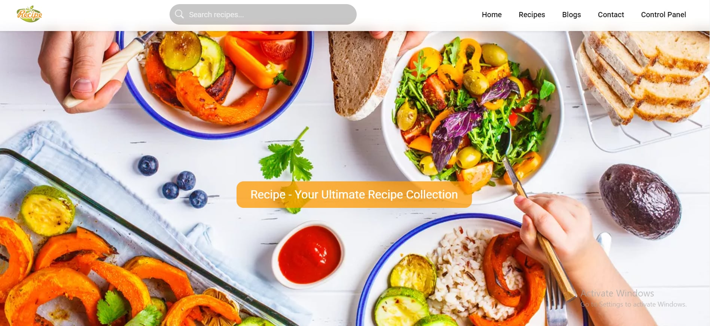
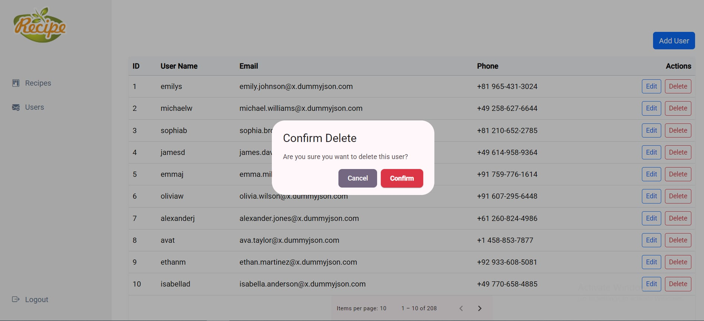
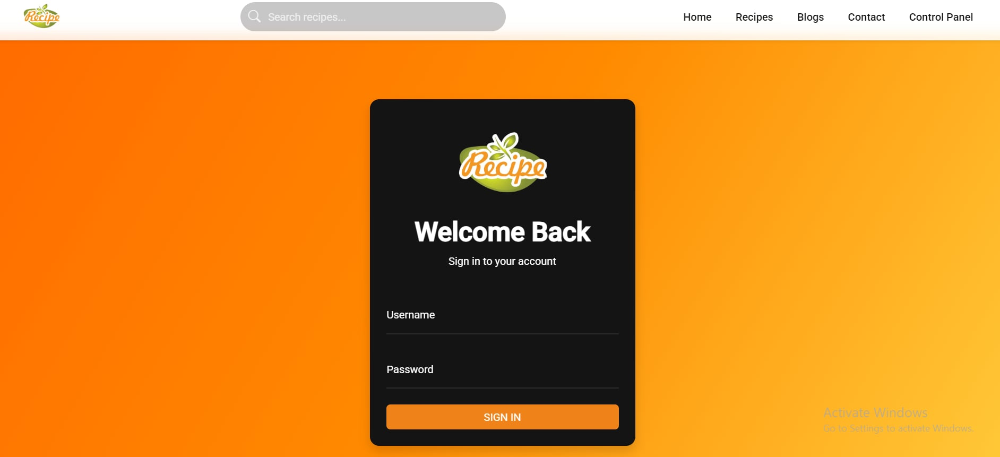

# Recipes Application 🍽️

A modern Angular Recipes Application that allows users to browse recipes and blogs, while providing an admin dashboard to manage recipes and users with full authentication and authorization flow.

## 🌟 Features

- **Home Page:**  Displays a collection of featured Recipes and latest Blogs.
- **Navigation Bar:**
   Includes: Home , Recipes(All Recipes) , Blogs(All Blogs) , Contact Us Form , Dashboard(Protected).
- **Recipes Section:** Browse Recipes , Filterd Recipes , View Recipes Details.
- **Blogs Section:** Browse Blogs , View Blogs Details.
- **Dashboard(Admin Panel):**
  1) Manage Recipes (Add / Update / Delete).
  2) Manage Users (Add / Update / Delete).
  3) Confirm dialog before delete actions.
- **Authentication & Security:**
  1) Login & Logout
  2) Route protection using Guards
  3) HTTP Interceptor for handling requests
-**UI Enhancements:** Confirm Dialog , Alerts , Paginator for large data , Responsive Navbar & Footer & Elements.
- **Dummy JSON APIs:**  
  Used dummy JSON data to simulate real backend APIs and perform full CRUD operations
  for recipes and users.

## 🛠️ Technologies Used

- **Angular**
- **Angular Material**
- **TyypeScript**
- **RxJS**
- **HTML5**  
- **CSS3**  
- **Bootstrap** for responsive design and components  
- **FontAwesome** for icons

## 📸 Screenshots

| Home | Dashboard | Login |
|------|-----------|-------|
|  |  |  |

## 🚀 How to Run

1- Clone the repository:
git clone https://github.com/SSamoel/RecipeAngularProject.git

2-Install dependencies:
npm install

3-Run the application:
ng serve

4-Open your browser:
http://localhost:4200

